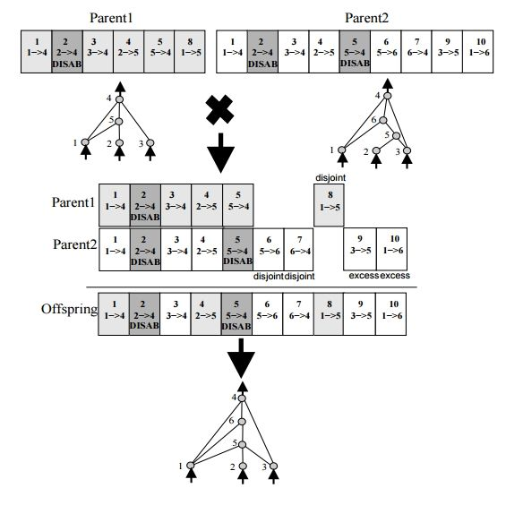

# NEAT-template

This my JAVA implementation of a neuroevolutionary algoritm called NEAT.

Original paper: [http://nn.cs.utexas.edu/downloads/papers/stanley.ec02.pdf](http://nn.cs.utexas.edu/downloads/papers/stanley.ec02.pdf)

[Here](https://www.youtube.com/watch?v=qv6UVOQ0F44) is a video that demonstrates its abilities
An image about the crossover of two genomes:

